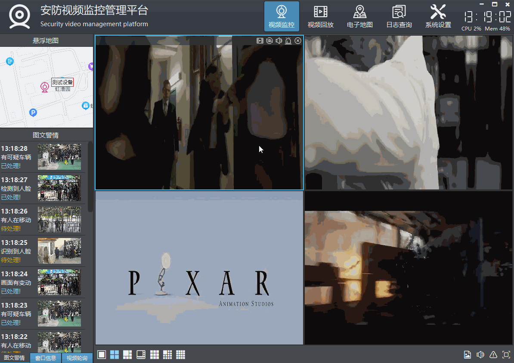
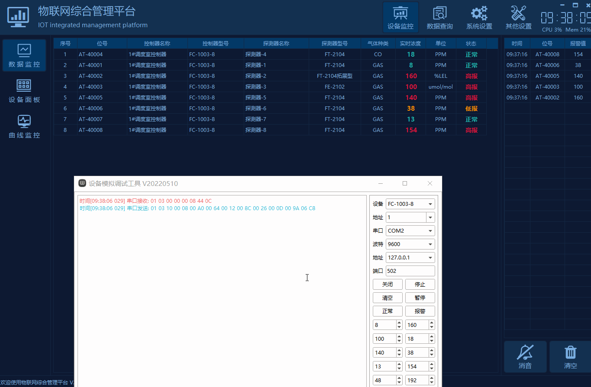

## 0 前言说明
1. **项目作品：[https://qtchina.blog.csdn.net/article/details/97565652](https://qtchina.blog.csdn.net/article/details/97565652)**
2. **视频主页：[https://space.bilibili.com/687803542](https://space.bilibili.com/687803542)**
3. **网店地址：[https://shop244026315.taobao.com](https://shop244026315.taobao.com)**
4. **联系方式：QQ（517216493）微信（feiyangqingyun）推荐加微信。**
5. **公 众 号：Qt实战/Qt入门和进阶/Qt教程/Qt软件**
6. **版本支持：所有项目已经全部支持Qt4/5/6所有版本以及后续版本。**
7. 监控作品体验：[https://pan.baidu.com/s/1d7TH_GEYl5nOecuNlWJJ7g](https://pan.baidu.com/s/1d7TH_GEYl5nOecuNlWJJ7g) 提取码：01jf
8. 其他作品体验：[https://pan.baidu.com/s/1ZxG-oyUKe286LPMPxOrO2A](https://pan.baidu.com/s/1ZxG-oyUKe286LPMPxOrO2A) 提取码：o05q
9. 监控系统在线文档：[http://www.qtcdev.com/video_system/](http://www.qtcdev.com/video_system/)
10. 大屏系统在线文档：[http://www.qtcdev.com/bigscreen/](http://www.qtcdev.com/bigscreen/)
11. 物联网系统在线文档：[http://www.qtcdev.com/iotsystem/](http://www.qtcdev.com/iotsystem/)

## 1 视频监控系统
### 1.1 软件模块
1. 视频监控模块，各种停靠小窗体子模块，包括设备列表、图文警情、窗口信息、云台控制、预置位、巡航设置、设备控制、悬浮地图、网页浏览等。
2. 视频回放模块，包括本地回放、远程回放、设备播放、图片回放、视频上传等。
3. 电子地图模块，包括图片地图、在线地图、离线地图、路径规划等。
4. 日志查询模块，包括本地日志、设备日志等。
5. 系统设置模块，包括系统设置（基本设置、视频参数、数据库设置、地图配置、串口配置等）、录像机管理、摄像机管理、轮询配置、用户管理等。

### 1.2 基础功能
1. 支持各种视频流（rtsp、rtmp、http等）、视频文件（mp4、rmvb、avi等）、本地USB摄像机播放。
2. 支持多画面切换，包括1、4、6、8、9、13、16、25、36、64画面切换。
3. 支持全屏切换，多种切换方式包括鼠标右键菜单、工具栏按钮、快捷键（alt+enter全屏，esc退出全屏）。
4. 支持视频轮询，包括1、4、9、16画面轮询，可设置轮询分组（轮询预案）、轮询间隔、码流类型等。
5. 支持onvif协议，包括设备搜索、云台控制、设备控制（图片参数、校对时间、系统重启，抓拍图片等）。
6. 支持权限管理，不同的用户可以对应不同的模块权限，比如删除日志、关闭系统等。
7. 数据库支持多种，包括sqlite、mysql、sqlserver、postgresql、oracle、人大金仓等。
8. 本地USB摄像机支持设置分辨率、帧率等参数。
9. 所有停靠模块都自动生成对应的菜单用来控制显示和隐藏，在标题栏右键可以弹出。
10. 支持显示所有模块、隐藏所有模块、复位普通布局、复位全屏布局。
11. 双击设备弹出实时预览视频，支持图片地图、在线地图、离线地图等。
12. 摄像机节点拖曳到对应窗体播放视频，同时支持拖曳本地文件直接播放。
13. 删除视频支持鼠标右键删除、悬浮条关闭删除、拖曳到视频监控面板外删除等多种方式。
14. 图片地图上设备按钮可自由拖动，自动保存位置信息。百度地图上可以鼠标单击获取经纬度信息，用来更新设备位置。
15. 视频监控面板窗体中任意通道支持拖曳交换，瞬间响应。
16. 封装了百度地图，视图切换，运动轨迹，设备点位，鼠标按下获取经纬度等。
17. 双击节点、拖曳节点、拖曳窗体交换位置等操作，均自动更新保存最后的播放地址，下次软件打开自动应用。
18. 右下角音量条控件，失去焦点自动隐藏，音量条带静音图标。
19. 支持视频截图，可指定单个或者对所有通道截图，底部小工具栏也有截图按钮。
20. 支持超时自动隐藏鼠标指针、自动全屏机制。
21. 支持onvif云台控制，可上下左右移动云台摄像机，包括复位和焦距调整等。
22. 支持任意onvif摄像机，包括但不限于海康、大华、宇视、天地伟业、华为等。
23. 可保存视频，可选定时存储或者单文件存储，可选存储间隔时间。
24. 可设置视频流通信方式tcp+udp，可设置视频解码是速度优先、质量优先、均衡等。
25. 可设置软件中文名称、英文名称、LOGO图标等。
26. 存储的视频文件支持导出到指定目录，支持批量上传到服务器。

### 1.3 特色功能
1. 主界面采用停靠窗体模式，各种组件以小模块的形式加入，可自定义任意模块加入。
2. 停靠模块可拖动任意位置嵌入和悬浮，支持最大化全屏，支持多屏幕。
3. 双重布局文件存储机制，正常模式、全屏模式都对应不同的布局方案，自动切换和保存，比如全屏模式可以突出几个模块透明显示在指定位置，更具科幻感现代化。
4. 原创onvif协议机制，采用底层协议解析（udp广播搜索+http请求执行命令）更轻量易懂易学习拓展，不依赖任何第三方组件比如gsoap。
5. 原创数据导入导出机制，跨平台不依赖任何组件，瞬间导出数据。
6. 内置多个原创组件，宇宙超值超级牛逼，包括数据导入导出组件（导出到xls、pdf、打印）、数据库组件（数据库管理线程、自动清理数据线程、万能分页、数据请求等）、地图组件、视频监控组件、文件多线程收发组件、onvif通信组件、通用浏览器内核组件等。
7. 自定义信息框+错误框+询问框+右下角提示框（包含多种格式）等。
8. 精美换肤，高达17套皮肤样式随意更换，所有样式全部统一，包括菜单等。
9. 视频控件悬浮条可以自行增加多个按钮，监控界面底部小工具栏也可自行增加按钮。
10. 双击摄像机节点自动播放视频，双击节点自动依次添加视频，会自动跳到下一个，双击父节点自动添加该节点下的所有视频。可选主码流、子码流。
11. 录像机管理、摄像机管理，可添加删除修改导入导出打印信息，立即应用新的设备信息生成树状列表，不需重启。
12. 可选多种内核自由切换，ffmpeg、vlc、mpv等，均可在pro中设置。推荐用ffmpeg，跨平台最多，默认提供好了linux和mac平台上编译好的库。
13. 支持硬解码，可设置硬解码类型（qsv、dxva2、d3d11va等）。
14. 默认采用opengl绘制视频，超低的CPU资源占用，支持yuyv和nv12两种格式绘制，很牛逼。
15. 高度可定制化，用户可以很方便的在此基础上衍生自己的功能，比如增加自定义模块，增加运行模式、机器人监控、无人机监控、挖掘机监控等。
16. 支持xp、win7、win10、linux、mac、各种国产系统（UOS、中标麒麟、银河麒麟等）、嵌入式linux等系统。
17. 注释完整，项目结构清晰，超级详细完整的使用开发手册，精确到每个代码文件的功能说明，不断持续迭代版本。

### 1.4 效果图
 

## 2 大屏电子看板
### 2.1 功能特点
1. 采用分层设计，整体总共分三级界面，一级界面是整体布局，二级界面是单个功能模块，三级界面是单个控件。
2. 子控件包括饼图、圆环图、曲线图、柱状图、柱状分组图、横向柱状图、横向柱状分组图、合格率控件、百分比控件、进度控件、设备状态面板、表格数据、地图控件、视频控件等。
3. 二级界面可以自由拖动悬浮，支持最小化隐藏、最大化关闭、响应双击自定义标题栏。
4. 数据源支持模拟数据（默认）、数据库采集、串口通信（需定制）、网络通信（需定制）、网络请求等，可自由设定每个子界面的采集间隔即数据刷新频率。
5. 采用纯QWidget编写，亲测Qt4.6到Qt6.2任意版本，理论上支持后续其他Qt版本。
6. 超强跨平台，亲测windows、linux、mac、国产uos、国产银河麒麟kylin等系统，效果完美，同时还支持嵌入式linux比如树莓派、香橙派、全志、imx6等。
7. 同时集成了自定义控件、qchart饼图、echart地图等功能。
8. 内置多套配色风格样式（紫色、蓝色、深蓝、黑色），默认紫色，自适应任意分辨率。
9. 可设置系统标题、目标分辨率、布局方案，启动立即应用。
10. 可设置主背景颜色、面板颜色、十字线游标颜色等各种颜色。
11. 可设置多条曲线不同颜色，没有设置颜色的情况下内置多套精美颜色随机应用。
12. 可设置标题栏背景颜色、文字颜色。
13. 可设置曲线图表背景颜色、文字颜色、网格颜色。
14. 可设置正常颜色、警戒颜色、报警颜色、禁用颜色、百分比进度颜色。
15. 可分别设置各种字体大小，比如全局字体、软件名称、标题栏、子标题栏、加粗标签等。
16. 可设置标题栏高度、表头高度、行高度。
17. 曲线支持游标、定位线、悬停高亮数据点、悬停显示值。
18. 柱状图支持顶部（可设置顶端、上部、中间、底部）显示数据，全部自适应计算位置。
19. 支持平滑曲线，内置多种平滑曲线算法，还支持面积图平滑。
20. 面积图填充颜色可选多种规则比如单色透明度填充、透明度渐变填充等。
21. 数据库支持sqlite、mysql、postgresql、oracle、国产人大金仓等数据库。
22. 主界面直接鼠标右键切换布局、配色方案、关闭开启某个二级窗体。
23. 自动记忆所有子窗口的大小和位置，下次启动立即应用。
24. 动态加载布局方案菜单，可以动态新建布局、恢复布局、保存布局、另存布局等，用户可以制造任意布局。
25. 二级窗体，双击从主窗体分离出来浮动，可以自由调整大小。再次双击标题栏最大化，再次双击还原。
26. 子模块也可以全屏显示作为一个大屏，这样就可以一个大屏拓展出多个子大屏，放大查看子模块的数据详情，适用多屏展示。
27. 每个模块都可以自定义采集速度，如果是数据库采集会自动排队处理，后期还可以拓展每个子模块都独立的数据库采集。
28. 提供系统设置模块进行整体的配置参数设置，效果立即应用。
29. 提供精美炫酷的大屏地图模块，包括静态图片、闪烁效果、迁徙效果、世界地图、区域地图等，可指定点的经纬度坐标，识别单击响应，可以做地图跳转等，每个点都可以不同的颜色和提示信息。
30. 除了提供大屏系统外，还将每个模块都做了独立的模块示例界面，每个模块都可以独立学习使用，里面用到的控件也单独做了控件示例界面，方便学习每个控件如何使用。
31. 非常详细的开发和使用手册，其中包括数据库说明、模块对照图、控件对照图、项目结构、代码说明（精确到每个类）、演示demo、使用方法等。

### 2.2 效果图
 
 
 
 

## 3 物联网平台
### 3.1 软件模块
1. 设备监控模块，包括数据监控（表格形式展示）、设备面板（面板形式展示）、地图监控（地图形式展示）、曲线监控（曲线形式展示）。
2. 数据查询模块，包括报警记录、运行记录、操作记录。
3. 系统设置模块，包括基本设置、端口管理、控制器管理、探测器管理、报警联动、类型设置等。
4. 其他设置模块，包括用户管理、地图管理、位置调整、组态设计、设备调试等。

### 3.2 基础功能
1. 设备数据采集，支持串口、网络，串口可设置串口号、波特率，网络可设置IP地址、通讯端口。
2. 每个端口支持采集周期时间，默认1秒钟一个设备。
3. 支持设置通讯超时次数，默认3次。
4. 支持最大重连时间，用于重新读取离线的设备。
5. 控制器信息，能够添加控制器名称，选择控制器地址、控制器型号，设置该控制器下面的探测器数量。
6. 探测器信息，能够添加位号、探测器型号、气体种类、气体符号、高报值、低报值、缓冲值、清零值、是否启用、报警声音、背景地图、存储周期、数值换算小数点位数、报警延时时间、报警的类型（HH,LL,HL）等。
7. 类型管理可配置控制器型号、探测器型号、气体种类、气体符号等。
8. 地图支持导入和删除，所有的探测器在地图上的位置可自由拖动保存。
9. 端口信息、控制器信息、探测器信息、类型信息、用户信息等，都支持导入、导出、导出到excel、打印。
10. 运行记录、报警记录、操作记录，都支持多条件组合查询，比如时间段、控制器、探测器等，所有记录支持导出到excel/pdf和打印。
11. 运行记录、报警记录、操作记录都可删除指定时间范围内的数据。
12. 系统设置可选择对应表最大保存记录数，自动清理早期数据，留出足够的空间存储重要的数据。
13. 报警短信转发，支持多个接收手机号码，可设定发送间隔，比如即时发送或者6个小时发送一次所有的报警信息，短信内容过长，自动拆分多条短信。
14. 报警邮件转发，支持多个接收邮箱，可设定发送间隔，比如即时发送或者6个小时发送一次所有的报警信息，支持附件发送。
15. 设置软件的中文标题、英文标题、logo路径、版权所有等。
16. 开关设置开机运行、报警声音、自动登录、记住密码等。
17. 报警声音可设置播放次数，界面风格样式提供18套皮肤文件选择。
18. 用户管理，包括用户权限配置，不同用户可以有不同模块的权限。
19. 用户登录和用户退出，可以记住密码和自动登录，超过三次报错提示并关闭程序。
20. 四种监控模式，设备面板监控、地图监控、表格数据监控、曲线数据监控，可自由切换，四种模式下都实时展示采集到的数据，报警闪烁等。
21. 报警继电器联动，一个位号可以跨串口联动多个模块和继电器号，支持多对多。

### 3.3 特色功能
1. 通信协议支持modbus_com、modbus_tcp_rtu，后期拓展mqtt等协议。
2. 数据源除了真实的硬件设备采集，还可选数据库采集，这样用户可以安排其他程序员比如java程序员将前端采集好的数据放到数据库，本系统直接从数据库采集即可。数据库采集模式可以作为通用的系统使用，更适合多人多系统协作。
3. 智能跳过超时的设备，加快对在线设备的采集速度，当设备数量很多的时候尤其有用。
4. 对智能跳过的超时的设备，在设定的重连时间自动采集一次，以便探测设备是否又重新上线。
5. 每个探测器可控是否启用，不启用则不会采集，也不会在界面显示，相当于运行阶段临时关闭。
6. 探测器可设置缓冲值和报警延时时间，在该值附近波动产生的报警，不计入报警，只有持续处于报警值且超过报警延时时间才算真正报警，这样可以规避很多波动导致的误报。
7. 探测器可设置存储周期，按照设定的时间来存储一条运行记录，可以按照重要程度对重要性高的设定存储周期短一些，不重要的设定大一些，这样可以节省不少的存储空间，也保证了重要的数据及时存储。
8. 探测器可设置清零值，在一些高精度高灵敏的设备可能出厂的时候默认值未必是0，需要设定清零值来表示初始值。
9. 探测器可设置小数点，用于计算后的真实数据控制小数点点位显示，相当于除以10、除以100、除以1000，这样大部分的探测器数据直接通过小数点位设置控制真实换算后的值，极个别的需要特殊转换的可以在通信协议中约定。
10. 探测器报警的类型支持多种，有些设备是高于某个值高报，低于某个值低报，而有些设备是在最小值最大值范围内是高报，低于最小值低报，高于最大值正常。这样可以分情况处理，涵盖各种报警类型。
11. 原创数据导入、导出、打印机制，跨平台不依赖任何组件，瞬间导出数据。
12. 导出到excel的记录支持所有excel、wps等表格文件版本，不依赖excel等软件。
13. 高报颜色、低报颜色、正常颜色、默认值颜色等，都可以自由设置。
14. 支持云端数据同步，将本地采集到的数据实时同步到云端。
15. 支持网络转发和网络接收，网络接收开启后，软件从udp接收数据进行解析。网络转发支持多个目标IP，这样就实现了本地采集的软件，自由将数据转到客户端，随时查看采集到的数据。
16. 自动记住用户最后停留的界面以及其他配置信息，重启后自动应用。
17. 报警自动切换到对应的地图，探测器按钮闪烁，表格数据对应颜色显示。
18. 双击探测器图标，弹出对应探测器详细信息，可以根据需要定制回控操作。
19. 数据库支持多种，包括sqlite、mysql、sqlserver、postgresql、oracle、人大金仓等。
20. 本地设备采集到的数据实时上传到云端，以便手机APP或者web等其他方式提取。
21. 自带设备模拟工具，支持不同型号的多个设备数据模拟，同时还带数据库数据模拟，以便在没有设备的时候测试数据。
22. 标准modbus协议，各种控制器类型、探测器类型、种类、符号等全部自定义，非常灵活和强大，通信协议示例数据非常完整，通用各种modbus协议系统，适用于各种应用场景接入。
23. 同时集成了串口通信、网络通信、数据库通信、数据导入导出打印、通信协议解析、界面UI、全局换肤等众多组件和知识点，非常适合新手入门和进阶。
24. 支持xp、win7、win10、、win11、linux、mac、各种国产系统（UOS、中标麒麟、银河麒麟等）、嵌入式linux等系统。
25. 注释完整，项目结构清晰，超级详细完整的使用开发手册，精确到每个代码文件的功能说明，不断持续迭代版本。

### 3.4 效果图
 

## 4 智能安防平台
### 4.1 功能特点
1. 同时集成了楼宇对讲、住户报警、门禁控制、公共报警、视频监控等模块。
2. 系统管理部分包括系统配置、对讲配置、住户配置、公共配置、监控配置、地图管理、视频联动、用户管理、区域管理。
3. 图形化的实时对讲、室内报警、门禁设备界面，非常大气美观。
4. 设备状态内置地图模式、面板模式两种方式展示，非常强大。
5. 楼宇对讲设备和报警设备都支持地图上拖曳到正确位置，保存立即应用。
6. 支持报警视频联动，设备报警对应弹出报警视频。
7. 各种设备信息支持添加、删除、修改、打印、导入、导出、查询等，支持多条件组合查询。
8. 各种日志信息支持多条件组合模糊查询，查询的记录可导出和打印。
9. 可直接在软件上授权发卡，支持多对多发卡，一个卡号可以发到多个门禁设备，支持通卡（卡号下发到所有设备），可连续自动制卡，自动选中下一个用户进行制卡。
10. 可直接远程读取选中设备的卡号集合信息，进行统一的管理。
11. 所有卡号支持本地备份，一旦远程设备更换，可以重新下发卡号信息。
12. 支持过期卡号自动清理，被清理的卡号可以查询，可以指定楼栋、单元、过期时间查询卡号。
13. 支持公共部位报警接入，默认DS7400主机，能够识别布防、撤防、报警等信息。
14. 视频监控默认支持16通道显示，可切换到4通道、6通道、8通道、9通道、13通道显示，支持全屏和轮询。
15. 首页背景图、左上角logo、右上角项目名称可自定义，支持恢复出厂设置。
16. 亿级别本地海量数据存储，自动清空早期数据，永远保持最新的数据记录。
17. 每个模块都有开关可以后台自由控制启用或者禁用。
18. 集成了秘钥控制功能，可以控制设备数量以及运行时间。
19. 内置最牛逼的豪华版的输入法，高仿苹果电脑输入法，体验一级棒。
20. 纯Qt编写，支持任意Qt版本+任意编译器+任意系统，可运行在windws XP、win7、win8、win10、linux、mac OS、嵌入式linux等系统。

### 4.2 效果图
 
 
 
 
 
 
