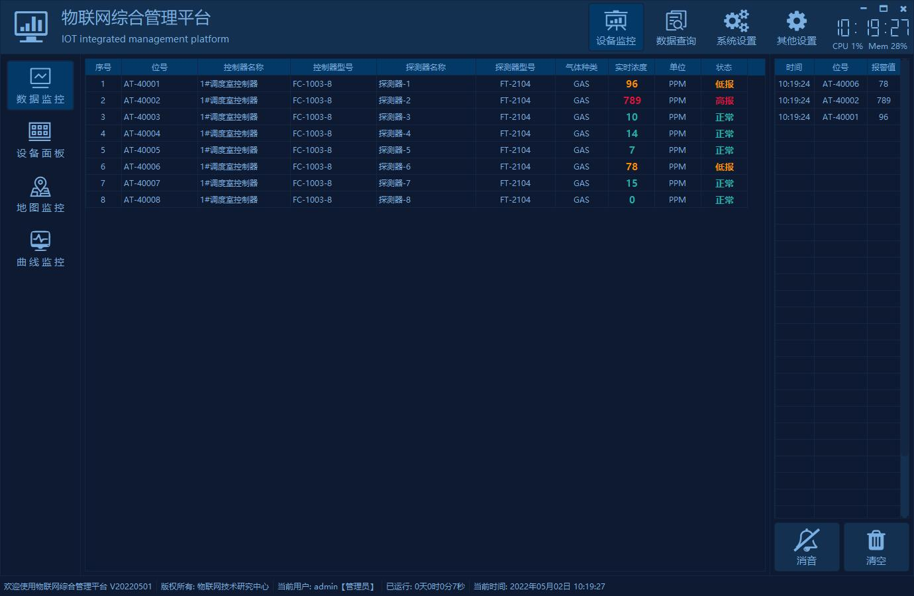
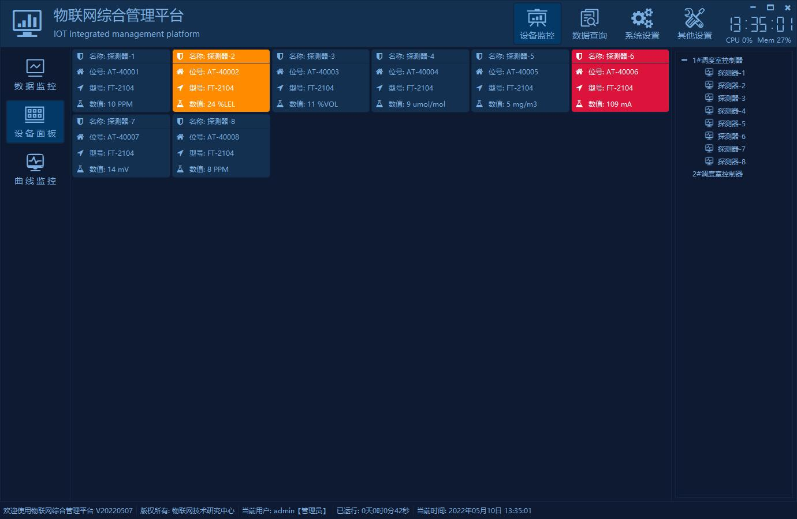
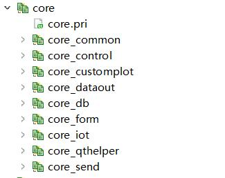
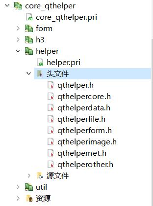
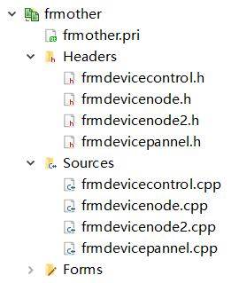
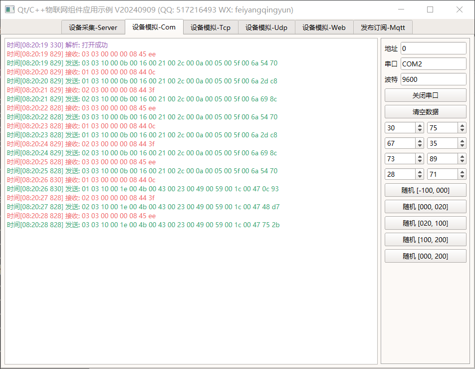
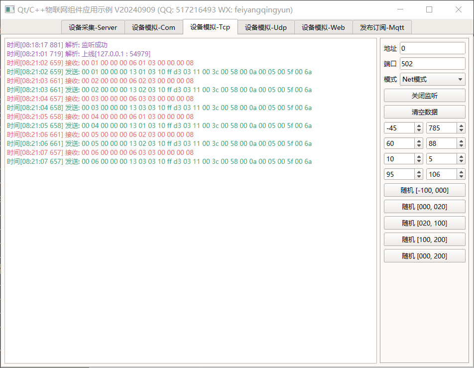

## 0 前言说明
### 0.1 编译说明
1. 记得将源码下的file目录下（切记是file目录下而不是file目录）的所有文件复制到可执行文件同一目录。
2. 打开pro文件，修改DEFINES中的 iottool1 为 iottool，则编译出来的是设备模拟工具，用于没有外接硬件设备时候模拟设备数据测试用。
3. 编译完成后，先双击打开iottool.exe，这个是设备模拟工具，再打开iotsystem.exe，这个是主程序，主程序建议添加两个通信端口，一个串口端口和一个网络端口，设备模拟工具会自动打开串口和网络进行数据的模拟。
4. db目录下的 iotsystem.mbs 为modbus模拟数据模板，可以用modbus slave软件打开。
5. db目录为数据库文件夹，iotsystem.db为sqlite数据库文件，sql结尾的为建库脚本，可以自行改成mysql数据库。
6. 在端口设置中如果不填写串口号则取网络地址，填了串口号则以串口号优先。
7. 如果导出的数据到excel以后，打开文件有提示，请先执行db目录下的excel禁止提示.reg文件。

### 0.2 功能特点
#### 0.2.1 软件模块
1. 设备监控模块，包括数据监控（表格形式展示）、设备面板（面板形式展示）、地图监控（地图形式展示）、曲线监控（曲线形式展示）。
2. 数据查询模块，包括报警记录、运行记录、操作记录。
3. 系统设置模块，包括基本设置、端口管理、控制器管理、探测器管理、报警联动、类型设置等。
4. 其他设置模块，包括用户管理、地图管理、位置调整、组态设计、设备调试等。

#### 0.2.2 基础功能
1. 设备数据采集，支持串口、网络，串口可设置串口号、波特率，网络可设置IP地址、通讯端口。
2. 每个端口支持采集周期时间，默认1秒钟一个设备。
3. 支持设置通讯超时次数，默认3次。
4. 支持最大重连时间，用于重新读取离线的设备。
5. 控制器信息，能够添加控制器名称，选择控制器地址、控制器型号，设置该控制器下面的探测器数量。
6. 探测器信息，能够添加位号、探测器型号、气体种类、气体符号、高报值、低报值、缓冲值、清零值、是否启用、报警声音、背景地图、存储周期、数值换算小数点位数、报警延时时间、报警的类型（HH,LL,HL）等。
7. 类型管理可配置控制器型号、探测器型号、气体种类、气体符号等。
8. 地图支持导入和删除，所有的探测器在地图上的位置可自由拖动保存。
9. 端口信息、控制器信息、探测器信息、类型信息、用户信息等，都支持导入、导出、导出到excel、打印。
10. 运行记录、报警记录、操作记录，都支持多条件组合查询，比如时间段、控制器、探测器等，所有记录支持导出到excel/pdf和打印。
11. 运行记录、报警记录、操作记录都可删除指定时间范围内的数据。
12. 系统设置可选择对应表最大保存记录数，自动清理早期数据，留出足够的空间存储重要的数据。
13. 报警短信转发，支持多个接收手机号码，可设定发送间隔，比如即时发送或者6个小时发送一次所有的报警信息，短信内容过长，自动拆分多条短信。
14. 报警邮件转发，支持多个接收邮箱，可设定发送间隔，比如即时发送或者6个小时发送一次所有的报警信息，支持附件发送。
15. 设置软件的中文标题、英文标题、logo路径、版权所有等。
16. 开关设置开机运行、报警声音、自动登录、记住密码等。
17. 报警声音可设置播放次数，界面风格样式提供18套皮肤文件选择。
18. 用户管理，包括用户权限配置，不同用户可以有不同模块的权限。
19. 用户登录和用户退出，可以记住密码和自动登录，超过三次报错提示并关闭程序。
20. 四种监控模式，设备面板监控、地图监控、表格数据监控、曲线数据监控，可自由切换，四种模式下都实时展示采集到的数据，报警闪烁等。
21. 报警继电器联动，一个位号可以跨串口联动多个模块和继电器号，支持多对多。

#### 0.2.3 特色功能
1. 通信协议支持modbus_com、modbus_tcp_rtu，后期拓展mqtt等协议。
2. 数据源除了真实的硬件设备采集，还可选数据库采集，这样用户可以安排其他程序员比如java程序员将前端采集好的数据放到数据库，本系统直接从数据库采集即可。数据库采集模式可以作为通用的系统使用，更适合多人多系统协作。
3. 智能跳过超时的设备，加快对在线设备的采集速度，当设备数量很多的时候尤其有用。
4. 对智能跳过的超时的设备，在设定的重连时间自动采集一次，以便探测设备是否又重新上线。
5. 每个探测器可控是否启用，不启用则不会采集，也不会在界面显示，相当于运行阶段临时关闭。
6. 探测器可设置缓冲值和报警延时时间，在该值附近波动产生的报警，不计入报警，只有持续处于报警值且超过报警延时时间才算真正报警，这样可以规避很多波动导致的误报。
7. 探测器可设置存储周期，按照设定的时间来存储一条运行记录，可以按照重要程度对重要性高的设定存储周期短一些，不重要的设定大一些，这样可以节省不少的存储空间，也保证了重要的数据及时存储。
8. 探测器可设置清零值，在一些高精度高灵敏的设备可能出厂的时候默认值未必是0，需要设定清零值来表示初始值。
9. 探测器可设置小数点，用于计算后的真实数据控制小数点点位显示，相当于除以10、除以100、除以1000，这样大部分的探测器数据直接通过小数点位设置控制真实换算后的值，极个别的需要特殊转换的可以在通信协议中约定。
10. 探测器报警的类型支持多种，有些设备是高于某个值高报，低于某个值低报，而有些设备是在最小值最大值范围内是高报，低于最小值低报，高于最大值正常。这样可以分情况处理，涵盖各种报警类型。
11. 原创数据导入、导出、打印机制，跨平台不依赖任何组件，瞬间导出数据。
12. 导出到excel的记录支持所有excel、wps等表格文件版本，不依赖excel等软件。
13. 高报颜色、低报颜色、正常颜色、默认值颜色等，都可以自由设置。
14. 支持云端数据同步，将本地采集到的数据实时同步到云端。
15. 支持网络转发和网络接收，网络接收开启后，软件从udp接收数据进行解析。网络转发支持多个目标IP，这样就实现了本地采集的软件，自由将数据转到客户端，随时查看采集到的数据。
16. 自动记住用户最后停留的界面以及其他配置信息，重启后自动应用。
17. 报警自动切换到对应的地图，探测器按钮闪烁，表格数据对应颜色显示。
18. 双击探测器图标，弹出对应探测器详细信息，可以根据需要定制回控操作。
19. 数据库支持多种，包括sqlite、mysql、sqlserver、postgresql、oracle、人大金仓等。
20. 本地设备采集到的数据实时上传到云端，以便手机APP或者web等其他方式提取。
21. 自带设备模拟工具，支持不同型号的多个设备数据模拟，同时还带数据库数据模拟，以便在没有设备的时候测试数据。
22. 支持xp、win7、win10、、win11、linux、mac、各种国产系统（UOS、中标麒麟、银河麒麟等）、嵌入式linux等系统。
23. 注释完整，项目结构清晰，超级详细完整的使用开发手册，精确到每个代码文件的功能说明，不断持续迭代版本。

### 0.3 相关站点
1. 国内站点：[https://gitee.com/feiyangqingyun](https://gitee.com/feiyangqingyun)
2. 国际站点：[https://github.com/feiyangqingyun](https://github.com/feiyangqingyun)
3. 个人主页：[https://blog.csdn.net/feiyangqingyun](https://blog.csdn.net/feiyangqingyun)
4. 知乎主页：[https://www.zhihu.com/people/feiyangqingyun](https://www.zhihu.com/people/feiyangqingyun)
5. 产品主页：[https://blog.csdn.net/feiyangqingyun/article/details/97565652](https://blog.csdn.net/feiyangqingyun/article/details/97565652)
6. 在线文档：[https://feiyangqingyun.gitee.io/qwidgetdemo/iotsystem/](https://feiyangqingyun.gitee.io/qwidgetdemo/iotsystem/)
7. 体验地址：[https://pan.baidu.com/s/1ZxG-oyUKe286LPMPxOrO2A](https://pan.baidu.com/s/1ZxG-oyUKe286LPMPxOrO2A) 提取码：o05q 文件名：bin_iotsystem.zip。
8. 文章导航：[https://qtchina.blog.csdn.net/article/details/121330922](https://qtchina.blog.csdn.net/article/details/121330922)

### 0.4 特别说明
1. 主界面顶部为一级菜单导航，单击切换页面，软件的左侧为二级菜单导航。
2. 在左侧菜单中，单击按钮可以切换到对应的页面。
3. 软件会记住最后停留的页面，下次启动后自动切换。
4. 发现数据不对或者有误，可以直接在设备调试界面查看具体的通信数据。
5. 离线状态下双击设备面板或者设备按钮会主动立即重连一次，在线双击弹出详细信息。
6. 本系统中的控制器相当于主设备，探测器相当于子设备节点。软件采集是和控制器之间通信。

### 0.5 简易操作
1. 第一步：从顶部一级菜单切换到系统设置，然后左侧二级菜单切换到端口管理。
2. 第二步：添加好端口信息。
3. 第三步：切换到控制器管理，添加好控制器信息。
4. 第四步：切换到探测器管理，添加好探测器信息。
5. 第五步：如果需要地图，则切换到地图管理，导入地图，默认已经有5张地图。
6. 第六步：重启软件。

### 0.6 版本说明

**V20220428**
1. 将项目统一命名为iotsystem，对应设备模拟工具iottool。
2. 将多个模块提炼成通用模块，比如用户登录退出、数据库设置、用户管理等，这样可以和其他系统完全公用模块。
3. 统一调整项目模块，统一规划。
4. 重新截图，重新编写说明书和开发使用手册。
5. 权限控制增加用户管理、组态设计等，替换之前备用的模块A、模块B。
6. 将用户管理、组态设计、设备调试等模块移动到其他设置大类，方便管理。
7. 修复非最大化界面，拖动设备按钮会触发界面移动并且乱跳的BUG。
8. 修复本地电脑开启网络代理的情况下，网络链接本地IP地址报错提示 The proxy type is invalid for this operation 的BUG。
9. 模拟工具增加一键复位和一键报警按钮，用于设置没有报警的值和报警的值。
10. 修复Qt6中报警后重复触发报警声音会崩溃的BUG。
11. 统一梳理所有数据库字段长度，留有足够的余地。

**V20190712**
1. 控制器型号+探测器型号+气体种类+气体符号改成表格存储，新增探测器数量字段。
2. 当节点数量小于列数时候会宽度变宽的BUG。
3. 新增阿里云数据库同步，数据库采集模式会将数据库数据实时同步到阿里云。

**V20190624**
1. nodeinfo表新增nodezero字段，用于存储消零值，小于该值则显示为0，大于则显示真实值。
2. alarmlog表增加confirmuser、confirmtime、confirmcontent三个字段，存储报警记录的确认用户、确认时间、确认内容。
3. 新增了数据库读取模式，用于数据库采集显示数据。
4. 修复了Qt5.10版本以上，数据清理线程提示不能运行的BUG。不能在线程中用主线程创建的数据库。
5. 改进了部分代码。
6. 模拟器新增数据库模拟。
7. 配置文件新增模拟器的配置信息。
8. 修复表格中设置了单独的文字颜色，在选中时会被覆盖的BUG。
9. 新增报警右下角弹框。可以配置文件更改是否开启以及显示多久，默认开启。
10. 新增报警记录鼠标右键删除记录，支持多选批量删除。
11. 设备表格，按照气体种类升序+位号升序排列，以前是按照位号。
12. 控制器对应的最大探测器数量，已禁用，直接选择好探测器类型自动设置。


## 1 用户登录退出
### 1.1 用户登录
    
　　系统启动后，首先会弹出操作员登录界面，从操作员姓名的下拉框选择用户名，然后输入密码，（默认用户名密码都是admin）单击登录按钮，密码正确则会进入到系统主界面，错误会弹出提示，超过三次自动关闭，需要重新打开软件。在登录界面可以勾选是否记住密码，是否自动登录，如果勾选了记住密码，则下次启用软件会自动填入最后操作员的密码，勾选了自动登录则启动后直接进入主界面。默认开启了自动登录，不会弹出登录界面。

### 1.2 用户退出
 
　　在主界面单击右上角的关闭按钮，会弹出操作员退出界面，需要输入密码验证防止误关闭，会自动填入登录的用户名，密码输入正确才会退出软件。


## 2 系统设置
### 2.1 基本设置
系统设置主界面如下图：
 

#### 2.1.1 基本设置
 
基本设置中有部分参数的切换会自动重启应用。

**参数说明**
1. 开机运行：开启以后自动随着系统启动运行，默认开启。
2. 自动登录：开启以后会自动以最后登录的用户信息登录到系统，默认关闭。
3. 记住密码：开启以后会自动填入最后登录的用户信息到登录窗体，默认关闭。
4. 中文标题：软件左上角标题栏的中文标题，改动立即应用。
5. 英文标题：软件左上角标题栏的英文标题，改动立即应用。
6. 版权所有：当前软件版权所有的公司，显示在软件的底部信息栏中。
7. 调试日志：开启后会将打印日志输出到日志文件，默认关闭。
8. 运行时间：开启后会实时记录系统的运行时间，记录当前软件启动后运行了多久。
9. 工作模式：默认视频监控，可选机器人监控、无人机监控等。
10. 导航样式：用于选择顶部导航栏和左侧导航栏的样式，上侧+左侧表示顶部导航栏上侧样式（图标在上面，文字在下面），左侧导航栏左侧样式（图标在左侧，文字在右侧）。
11. 界面样式：系统自带17套皮肤，可以在这里自动换肤，默认视频黑。
12. 软件图标：自动从logo文件夹读取，可以自行选择对应的logo文件。
13. 报警声音：开启后当探测器报警后，会播放报警声音，默认开启。
14. 播放次数：播放报警声音的次数，默认1次。
15. 警情行数：主界面运行监测左侧显示报警信息的最大行数。新警情自动追加在最前面。
16. 自动确认：开启后自动确认警情存入报警记录，默认开启。
17. 设备列数：设备监控主界面设备面板的列数。
18. 记录行数：在数据查询的表格中，显示的记录的行数。

#### 2.1.2 本地数据库设置
 

**参数说明**
1. 远程同步：开启后将会启用云端数据同步功能，将本地数据实时同步到远程数据库中。
2. 主机类型：和本地数据库设置一样，可选多种。
3. 数据库名：对应数据库的数据库名称，一个数据库系统中可以有多个数据库实例。
4. 主机地址：数据库所在的网络地址，可以是IP地址或者网址。
5. 通信端口：数据库开放通信的端口，不同数据库默认端口不同，比如mysql是3306，postgres是5432，sqlserver是1433。
6. 用户名称：登录到网络数据库对应的用户名称，所有的网络型数据库都需要用户认证。sqlite是文件型数据库一般不需要认证。
7. 用户密码：登录到网络数据库对应的用户密码，所有的网络型数据库都需要用户认证。sqlite是文件型数据库一般不需要认证。
8. 连接测试：单击后主动连接一次当前填入的数据库信息，连接成功与失败都会弹框提示。
9. 初始数据：单击后会执行sql脚本文件，重置数据库，会将原来的数据一并清空。务必记得只有需要的时候才执行。

**其他说明**
1. 默认提供了数据库脚本文件（拓展名sql结尾的文件）。
2. 单击初始化数据按钮可以对整个数据库进行新建和重置，相当于恢复出厂。
3. 系统支持多种数据库，默认sqlite（Qt内置的数据库，无需安装），可选mysql、postgresql、oracle、人大金仓等。
4. 具体还需要对应Qt版本有数据库插件支持，没有插件支持可以自行编译对应缺失的插件比如mysql，也可选直接通过万能的ODBC来连接。
5. 除了sqlite数据库外，其余数据库都需要输入数据库名称、主机地址、通信端口、用户名称、用户密码信息，输入好以后可以单击连接测试按钮测试下是否正常。
6. 默认提供的是mysql的动态库libmysql.dll，需要放到可执行文件同一目录，严格区分32位和64位的动态库。

```cpp
//数据库类型枚举
enum DbType {
    DbType_ODBC = 0,        //odbc数据源
    DbType_Sqlite = 1,      //sqlite数据库
    DbType_MySql = 2,       //mysql数据库
    DbType_PostgreSQL = 3,  //postgresql数据库
    DbType_SqlServer = 4,   //sqlserver数据库
    DbType_Oracle = 5,      //oracle数据库
    DbType_KingBase = 6,    //人大金仓数据库
    DbType_Other = 255      //其他数据库
};

//自动切换默认数据库端口
void DbHelper::getDbDefaultInfo(const QString &dbType, QString &hostPort,
                                QString &userName, QString &userPwd)
{
    if (dbType == "MYSQL") {
        hostPort = "3306";
        userName = "root";
        userPwd = "root";
    } else if (dbType == "SQLSERVER") {
        hostPort = "1433";
        userName = "sa";
        userPwd = "123456";
    } else if (dbType == "POSTGRESQL") {
        hostPort = "5432";
        userName = "postgres";
        userPwd = "123456";
    } else if (dbType == "ORACLE") {
        hostPort = "1521";
        userName = "system";
        userPwd = "123456";
    } else if (dbType == "KINGBASE") {
        hostPort = "54321";
        userName = "SYSTEM";
        userPwd = "123456";
    }
}
```

#### 2.1.3 云端数据库同步
 

**参数说明**
1. 远程同步：开启后将会启用云端数据同步功能，将本地数据实时同步到远程数据库中。
2. 主机类型：和本地数据库设置一样，可选多种。
3. 数据库名：对应数据库的数据库名称，一个数据库系统中可以有多个数据库实例。
4. 主机地址：数据库所在的网络地址，可以是IP地址或者网址。
5. 通信端口：数据库开放通信的端口，不同数据库默认端口不同，比如mysql是3306，postgres是5432，sqlserver是1433。
6. 用户名称：登录到网络数据库对应的用户名称，所有的网络型数据库都需要用户认证。sqlite是文件型数据库一般不需要认证。
7. 用户密码：登录到网络数据库对应的用户密码，所有的网络型数据库都需要用户认证。sqlite是文件型数据库一般不需要认证。
8. 连接测试：单击后主动连接一次当前填入的数据库信息，连接成功与失败都会弹框提示。
9. 初始数据：单击后会执行sql脚本文件，重置数据库，会将原来的数据一并清空。务必记得只有需要的时候才执行。

#### 2.1.4 日志设置
 

**参数说明**
1. 报警记录：报警记录存储最大数量，超过会自动清理，相当于永远存储最近的记录，把早期数据清空，留给最新的数据，节约空间。
2. 运行记录：运行记录存储最大数量，超过会自动清理，相当于永远存储最近的记录，把早期数据清空，留给最新的数据，节约空间。
3. 操作记录：操作记录存储最大数量，超过会自动清理，相当于永远存储最近的记录，把早期数据清空，留给最新的数据，节约空间。
4. 记录排序：在报警记录查询界面中，按照何种方式排序，默认按照时间降序，相当于最新的记录在最前面。
5. 报警弹框：报警触发后在右下角弹框信息停留时间，0秒表示一直停留直到手动关闭，10000秒表示不弹出。
6. 小数点位：设备采集到的数据，最后按照几位小数点显示。

#### 2.1.5 网络转发设置
 
　　网络转发的功能，是用来将本地的采集的所有设备的数据，通过UDP协议转发到指定的IP和端口，对方只要开启网络接收即可查看到设备的实时运行数据。网络转发和网络接收不能同时开启，本地负责采集的软件开启网络转发，远程需要查看数据的电脑开启网络接收，转发的端口和接收的端口必须保持一致，支持多个IP，中间用英文的分号 ; 隔开。单击同步数据的按钮会将本地的端口+设备+节点信息传送到接收端，不需要手动设置。这样就保证了本地的信息和远程的信息完全一致。远程的IP必须保证可达，比如ping的通。

**参数说明**
1. 网络转发：开启后会将本地的数据通过udp协议发到指定的网络地址和端口。
2. IP及端口：网络转发要去达的网络地址和端口，用英文冒号 : 隔开。
3. 网络接收：开启后将采用接收端形式运行，接收转发过来的设备数据作为采集源。
4. 接收端口：网络接收端口。
5. 同步数据：开启网络转发后，单击该按钮，会将本地的端口信息、控制器信息、探测器信息发送到远端，这样远端接收到数据后不用手动添加。

#### 2.1.6 告警短信转发
 
　　当探测器发生报警后，如果开启了短信告警，会将报警信息以短信的形式发送到预先设定的接收者的手机号码上，短信内容格式为：位号: AT400001  控制器: 控制器A  探测器: 探测器A  触发值: 70.8 PPM  类型: 浓度上限报警  时间: 2019-01-05 12:12:12。需要本地发短信的硬件支持。

**参数说明**
1. 串口名称：短信猫设备接入的串口号。
2. 波 特 率：短信猫设备通信所使用的波特率。
3. 接收号码：接收者的手机号码，可以填写多个，中间用英文的分号 ; 隔开。
4. 发送间隔：短信发送的间隔，默认10000表示不开启，0表示实时发送。
5. 测试短信：单击该按钮会立即发送一条测试短信到接收者手机用于测试功能是否正常。

#### 2.1.7 告警邮件转发
 
　　当探测器发生报警后，如果开启了邮件转发告警，会将报警信息以邮件的形式发送到预先设定的接收者的邮箱中，邮件内容格式为：位号: AT400001  控制器: 控制器A  探测器: 探测器A  触发值: 70.8 PPM  类型: 浓度上限报警  时间: 2019-01-05 12:12:12。后期会将警情统计的报表数据以excel表格的形式发送到接收者邮箱。如果发现邮箱登录失败等，请先在邮箱后台设置开启smtp和pop3。

**参数说明**
1. 发件邮箱：发件人的邮箱地址，必须保证该邮箱开启过POP3。
2. 发件密码：发件人的邮箱的密码，会以加密的形式存储在配置文件。
3. 接收邮箱：接收者的邮箱地址，支持多个，用英文的分号 ; 隔开。
4. 发送间隔：邮件发送的间隔，默认10000表示不开启，0表示实时发送。
5. 测试邮件：单击该按钮会立即发送一条测试邮件到接收者邮箱用于测试功能是否正常。

#### 2.1.8 系统时间设置
 
用来设置本地电脑的系统时间，为什么需要这个设置，因为软件很可能在嵌入式linux上运行，需要手动设置时间。

#### 2.1.9 功能激活
 

**参数说明**
1. 表格联动：开启后在数据监控的表格中会自动实时显示采集的设备数据。
2. 面板联动：开启后在设备面板对应的设备会自动显示采集的设备数据。
3. 按钮联动：开启后在地图监控上对应的按钮会自动显示采集的设备数据。
4. 设备地图：开启后会显示设备地图模块，默认关闭，大部分场景用不上，只需要表格展示数据，最高效。

#### 2.1.10 颜色设置
 

**参数说明**
1. 离线颜色：探测器离线后对应文字显示的颜色。
2. 高报颜色：探测器发生上限报警（高报）后对应文字显示的颜色。
3. 低报颜色：探测器发生下限报警（低报）后对应文字显示的颜色。
4. 正常颜色：探测器运行正常时对应文字显示的颜色。
5. 曲线背景：探测器实时曲线界面背景颜色。
6. 曲线文字：探测器实时曲线界面文字颜色。
7. 曲线颜色：探测器实时曲线界面曲线的颜色。
8. 待定颜色：目前备用的颜色。

### 2.2 端口管理
 
本系统支持串口接入和网络接入两种方式，对应的端口需要提前设置，后期可能还会新增mqtt等方式，选择不同的协议类型即可。

**字段说明**
1. 端口编号：端口的编号，从1开始。
2. 端口名称：端口的别名，方便记忆。
3. 协议类型：默认Modbus_Com为串口通信，TCP通信选择Modbus_Tcp_Rtu。
4. 串 口 号：如果用的是串口通信，这里填入串口号即可。
5. 波 特 率：串口通信使用的波特率。
6. IP 地 址：设备的IP地址。
7. 通讯端口：该设备网络通信所使用的端口，默认502，即modbus通信的端口。
8. 采集周期：该通讯处理中对每个控制器轮询的间隔时间。单位秒，如果要0.2s=200毫秒则填0.2即可，默认浮点数处理。
9. 通讯超时：该通讯处理中大于几次未收到回应消息则判断为离线，默认3次。
10. 重连时间：如果某个设备离线状态，最大多长时间重新读取一次，默认60秒。

#### 2.2.1 端口添加
　　单击添加按钮，会自动规则生成默认的信息，直接表格中修改即可，修改好以后单击保存按钮保存所有的信息。

#### 2.2.2 端口删除
　　如果要删除某个端口信息，需要先选中该行，然后单击删除按钮，删除后会自动保存。

#### 2.2.3 端口清空
　　单击清空按钮会对整个表进行清空操作，清空后数据不能恢复，慎用。

#### 2.2.4 端口信息导入
　　单击导入按钮，可以选择之前导出的csv格式的文件导入数据。

#### 2.2.5 端口信息导出
　　单击导出按钮，将表格数据导出到csv格式的文件，用户可以打开文件编辑，然后再次导入，这样可以作为简易的备份机制使用，也可将繁琐的基础数据录入交给小姑娘去做。　　

#### 2.2.6 端口信息打印
 
　　单击打印按钮可以将表格中的内容打印出来，打印前会弹出打印预览界面，可以自行做边距的调整等，可以查看等待打印的内容，翻页切换。

#### 2.2.7 导出到Excel
 
　　单击导出按钮可以将表格中的内容导出到excel表格，独创的excel导出数据算法，极速导出，支持任意系统，无依赖。

### 2.3 控制器管理
 

**字段说明**
1. 控制器编号：控制器的编号，从1开始。
2. 通 讯 端口：通讯所采用的通讯端口名称，和端口管理中的端口名称一致。
3. 控制器名称：控制器的别名，以便记忆。
4. 控制器地址：控制器的地址，最大255。
5. 控制器型号：控制器的型号，不一样的控制器可能通信的协议不一致。
6. 探测器数量：该控制器下面挂载的探测器的数量，必须和真实安装的数量完全一致。

#### 2.3.1 控制器添加
　　单击添加按钮，会自动规则生成默认的信息，直接表格中修改即可，修改好以后单击保存按钮保存所有的信息。

#### 2.3.2 控制器删除
　　如果要删除某个控制器信息，需要先选中该行，然后单击删除按钮，删除后会自动保存。

#### 2.3.3 控制器清空
　　单击清空按钮会对整个表进行清空操作，清空后数据不能恢复，慎用。

#### 2.3.4 控制器信息导入
　　单击导入按钮，可以选择之前导出的csv格式的文件导入数据。

#### 2.3.5 控制器信息导出
　　单击导出按钮，将表格数据导出到csv格式的文件，用户可以打开文件编辑，然后再次导入，这样可以作为简易的备份机制使用，也可将繁琐的基础数据录入交给小姑娘去做。　　

#### 2.3.6 控制器信息打印
 
　　单击打印按钮可以将表格中的内容打印出来，打印前会弹出打印预览界面，可以自行做边距的调整等，可以查看等待打印的内容，翻页切换。

#### 2.3.7 导出到Excel
 
　　单击导出按钮可以将表格中的内容导出到excel表格，独创的excel导出数据算法，极速导出，支持任意系统，无依赖。

### 2.4 探测器管理
 

**字段说明**
1. 编    号：节点的编号，从1开始。
2. 位    号：探测器的位置编号，用于唯一标识一个探测器。
3. 控 制 器：对应挂载的主设备名称。
4. 探 测 器：探测器的名称，方便记忆，可以填写地理位置。
5. 地    址：探测器对应在控制器的编号索引。
6. 型    号：探测器的型号，从下拉框选择。
7. 气体种类：探测器对应采集的气体的种类。
8. 气体型号：探测器对应采集气体的型号。
9. 上 限 值：报警的上限值。
10. 下 限 值：报警的下限值
11. 最 大 值：最大的警戒值，超过该值则显示为该值。
12. 消    零：最小的警戒值，小于该值则显示0，大于显示真实值。
13. 量    程：假设量程0.25则 实际数=模拟量/4000*量程 模拟量就是采集的值。
14. 状    态：默认启用，当某个探测器未接时候可以选择禁用。
15. 声    音：报警后对应的声音文件。
16. 地    图：探测器所位于的地图文件。
17. 存    储：探测器记录存储的周期，单位分钟。即隔多久存储一次记录到本地。
18. 小 数 点：计算解析数据的数据位对应的小数点位数。
19. 报警延时：报警后，延时多久处理，以便过滤数据抖动偏差造成的误报。默认0。
20. 报警类型：HH LL HL。
21. X坐 标：探测器位于地图上的X坐标。
22. Y坐 标：探测器位于地图上的Y坐标。

**报警类型**
- 根据设定的不同的报警类型处理，假定上限值100，下限值25。
- HH表示超过25是低报，超过100是高报，低于25正常。
- HL表示低于25是低报，超过100是高报，25到100之间正常。
- LL表示低于25是高报，低于100是低报，大于100正常。

#### 2.4.1 探测器添加
　　单击添加按钮，会自动规则生成默认的信息，直接表格中修改即可，修改好以后单击保存按钮保存所有的信息。

#### 2.4.2 探测器删除
　　如果要删除某个探测器信息，需要先选中该行，然后单击删除按钮，删除后会自动保存。

#### 2.4.3 探测器清空
　　单击清空按钮会对整个表进行清空操作，清空后数据不能恢复，慎用。

#### 2.4.4 探测器信息导入
　　单击导入按钮，可以选择之前导出的csv格式的文件导入数据。

#### 2.4.5 探测器信息导出
　　单击导出按钮，将表格数据导出到csv格式的文件，用户可以打开文件编辑，然后再次导入，这样可以作为简易的备份机制使用，也可将繁琐的基础数据录入交给小姑娘去做。　　

#### 2.4.6 探测器信息打印
 
　　单击打印按钮可以将表格中的内容打印出来，打印前会弹出打印预览界面，可以自行做边距的调整等，可以查看等待打印的内容，翻页切换。

#### 2.4.7 导出到Excel
 
　　单击导出按钮可以将表格中的内容导出到excel表格，独创的excel导出数据算法，极速导出，支持任意系统，无依赖。

### 2.5 报警联动
 
　　在报警联动设置中，可以设置每个位号报警后，对应的继电器联动，支持探测器串口和新独立的串口（如果是和探测器并用的串口则不会重新打开串口，直接用原有的串口发数据联动，如果是新的串口则会重新打开串口），模块地址为继电器板子的地址，联动地址集合为需要联动报警的位，支持多个，多对多关系，一个探测器报警可以联动多个联动模块上的多个继电器地址，中间丨杠隔开。

**字段说明**
1. 位置编号：下拉选择，从探测器信息表取，表示哪个位置的探测器报警。
2. 串 口 号：串口号，可以是之前端口信息中的串口，会自动检测切换。
3. 波 特 率：报警端口转发串口对应的波特率，默认9600。
4. 模块地址：对应联动模块的地址，挂在总线上的联动模块的唯一地址，该模块专门用来做继电器联动。
5. 联动地址：联动模块上有一排继电器地址，对应报警后，可以触发联动一个或者多个继电器，需要哪个地址就填哪些地址。
6. 启    用：可以动态关闭不需要的联动信息，但是不删除，这样只需要这里取消启用即可，而不是删除，不然又要重新添加。

#### 2.5.1 联动添加
　　单击添加按钮，会自动规则生成默认的信息，直接表格中修改即可，修改好以后单击保存按钮保存所有的信息。

#### 2.5.2 联动删除
　　如果要删除某个联动信息，需要先选中该行，然后单击删除按钮，删除后会自动保存。

#### 2.5.3 联动清空
　　单击清空按钮会对整个表进行清空操作，清空后数据不能恢复，慎用。

#### 2.5.4 联动信息导入
　　单击导入按钮，可以选择之前导出的csv格式的文件导入数据。

#### 2.5.5 联动信息导出
　　单击导出按钮，将表格数据导出到csv格式的文件，用户可以打开文件编辑，然后再次导入，这样可以作为简易的备份机制使用，也可将繁琐的基础数据录入交给小姑娘去做。　　

#### 2.5.6 联动信息打印
 
　　单击打印按钮可以将表格中的内容打印出来，打印前会弹出打印预览界面，可以自行做边距的调整等，可以查看等待打印的内容，翻页切换。

#### 2.5.7 导出到Excel
 
　　单击导出按钮可以将表格中的内容导出到excel表格，独创的excel导出数据算法，极速导出，支持任意系统，无依赖。

### 2.6 类型设置
 

**参数说明**
- 本表格中的数据并不是严格的对应关系。
- 其中控制器信号、探测器数量是一对，其余全部独立。
- 用来在系统设置中对应下拉框中的信息。
- 这样就非常灵活，用户后期增加了新的产品直接在这里添加好就行，其他地方都是自动下拉选择。

#### 2.6.1 联动添加
　　单击添加按钮，会自动规则生成默认的信息，直接表格中修改即可，修改好以后单击保存按钮保存所有的信息。

#### 2.6.2 联动删除
　　如果要删除某个类型信息，需要先选中该行，然后单击删除按钮，删除后会自动保存。

#### 2.6.3 联动清空
　　单击清空按钮会对整个表进行清空操作，清空后数据不能恢复，慎用。

#### 2.6.4 联动信息导入
　　单击导入按钮，可以选择之前导出的csv格式的文件导入数据。

#### 2.6.5 联动信息导出
　　单击导出按钮，将表格数据导出到csv格式的文件，用户可以打开文件编辑，然后再次导入，这样可以作为简易的备份机制使用，也可将繁琐的基础数据录入交给小姑娘去做。　　

#### 2.6.6 联动信息打印
 
　　单击打印按钮可以将表格中的内容打印出来，打印前会弹出打印预览界面，可以自行做边距的调整等，可以查看等待打印的内容，翻页切换。

#### 2.6.7 导出到Excel
 
　　单击导出按钮可以将表格中的内容导出到excel表格，独创的excel导出数据算法，极速导出，支持任意系统，无依赖。

## 3 其他设置
### 3.1 用户管理
 
　　用户管理是后面增加的一个模块，用于设置不同的用户不同的类型+权限，可以细分到每个模块的权限，勾选表示具有该权限，内置了7种权限选择，后期还可以在此基础上增加其他权限等。

#### 3.1.1 用户添加
　　单击添加按钮，会自动规则生成默认的信息，直接表格中修改即可，修改好以后单击保存按钮保存所有的信息。

#### 3.1.2 用户删除
　　如果要删除某个用户信息，需要先选中该行，然后单击删除按钮，删除后会自动保存。不允许删除内置的admin用户。

#### 3.1.3 用户清空
　　单击清空按钮会对整个表进行清空操作，清空后数据不能恢复，慎用。

#### 3.1.4 用户信息导入
　　单击导入按钮，可以选择之前导出的csv格式的文件导入数据。

#### 3.1.5 用户信息导出
　　单击导出按钮，将表格数据导出到csv格式的文件，用户可以打开文件编辑，然后再次导入，这样可以作为简易的备份机制使用，也可将繁琐的基础数据录入交给小姑娘去做。

#### 3.1.6 用户信息打印
 
　　单击打印按钮可以将表格中的内容打印出来，打印前会弹出打印预览界面，可以自行做边距的调整等，可以查看等待打印的内容，翻页切换。

#### 3.1.7 导出到Excel
 
　　单击导出按钮可以将表格中的内容导出到excel表格，独创的excel导出数据算法，极速导出，支持任意系统，无依赖。

#### 3.1.8 权限验证
    
假设设置了用户没有系统设置和删除记录的权限，则关闭系统的时候会弹出错误信息提示当前用户没有权限。

### 3.2 地图管理
 
在地图管理中，可以导入和删除地图。

### 3.3 位置调整
 
位置调整中，可以拖动探测器到正确的位置，右侧单击地图切换可以看到对应的该地图对应的探测器，全部位置调整好之后，单击右下角保存按钮即可，会立即应用。

### 3.4 组态设计
 
 　　组态设计模块中提供的是简单的示例，如果加载自定义控件动态库、将控件拖曳到背景地图上，配置好对应控件的属性，可定义用户属性，可导出控件的配置信息到xml文件，并支持导入xml文件自动加载上次保存的控件配置信息。目前是一个简单的组态雏形，等后期架构好如何应用再重写整个模块。

### 3.5 设备调试
 
　　可以自行选择通讯端口+设备名称进行数据的过滤，可查看所有的通信数据。不同收发数据不同颜色，还可以指定关键字过滤数据，每个收发数据都有对应的中文解释。能够很方便的对运行中的系统查看设备数据，规避是下位机还是上位机问题扯皮的事情。


## 4 设备监控
 
设备监控界面主要包括4个模块，分别是数据监控、设备面板、地图监控、曲线监控，设备的实时数据可以同时反应到四个模块上面，相当于以4种不同的表现形式展现采集到的数据。
- 数据监控：表格形式一行行展示数据。
- 设备面板：每个探测器都是个独立的一个面板展示数据和信息。
- 地图监控：设备按钮放在对应地图上，长条状显示数据和符号单位。
- 曲线监控：对每个设备过滤曲线显示采集到的数据。
- 设备报警后，如果设置了报警弹窗，则右下角都会弹出对应的报警信息。
- 设备报警后，对应表格行、设备面板、地图按钮等都会突出颜色显示。

### 4.1 数据监控
 
　　本页面会是使用频率最高的页面，默认就是停留在本页面实时查看所有探测器的数据。左侧为警情信息栏，分别显示时间、位号、报警值。如果有探测器报警，则消息自动追加到最前面。
表格依次显示序号、位号、控制器名称、控制器型号、探测器名称、探测器型号、气体种类、浓度值、气体符号。

### 4.2 设备面板
 
　　设备作为一个个独立的设备面板控件，有多少个探测器就会生成多少个面板，放在容器中，可以在系统设置中选择设备列数，按照该设备列数来排列，超过会自动产生滚动条拖动查看。报警后整个设备面板会突出颜色显示比如高报是红色、低报是黄色等。双击探测器面板，会跳转到该探测器的详细信息界面，在该界面上后期可以按照实际用户需求定制回控操作。

### 4.3 地图监控
 
　　本页面以地图的形式显示所有探测器，右侧单击对应地图可以手动切换地图，当探测器报警后会自动切换到当前地图，探测器图标红色闪烁，探测器图标实时显示当前的浓度值。双击探测器按钮图标，会跳转到该探测器的详细信息界面，在该界面上后期可以按照实际用户需求定制回控操作。

### 4.4 曲线监控
　　在本页面可以查看某个探测器的实时曲线，第一步先选择通信端口，第二步选择控制器，第三步选择探测器，然后就可以在左侧看到实时曲线，颜色可以在系统设置中设置。单击打印按钮会将当前曲线以截图的形式打印出来。勾选暂停显示记录数据复选框会暂停显示当前的数据。

#### 4.4.1 实时曲线
 

#### 4.4.2 历史曲线
 

## 5 数据查询
### 5.1 报警记录
　　在本页面，可以指定日期范围查询报警记录，还可以查询单个的控制器或者探测器的报警记录。也可以手动输入探测器的位号进行查询，下拉选择探测器后会自动填入位号。还可以选择报警类型（浓度上限报警、浓度下限报警）查询对应的类型，也可以输入报警值进行精准查询。
　　如果数据超过一页，会自动分页处理，单击右侧的上一页、下一页、第一页、末一页进行翻页查看，所有查询的数据可以导出到excel表格，也可以直接打印。单击删除按钮会弹出时间范围选择框，选择该时间段后确定，会删除该时间段的所有记录。
　　双击对应的报警记录可以打开警情确认对话框，重新填写确认意见，鼠标右键弹出删除记录菜单，可以删除当前选中的记录，支持多选，例如按住Ctrl键选择多个记录。

#### 5.1.1 记录查询
 

#### 5.1.2 记录打印
 

#### 5.1.3 记录导出
    

### 5.2 运行记录
　　在本页面，可以指定日期范围查询运行记录，还可以查询单个的控制器或者探测器的运行记录。也可以手动输入探测器的位号进行查询，下拉选择探测器后会自动填入位号。
　　如果数据超过一页，会自动分页处理，单击右侧的上一页、下一页、第一页、末一页进行翻页查看，所有查询的数据可以导出到excel表格，也可以直接打印。单击删除按钮会弹出时间范围选择框，选择该时间段后确定，会删除该时间段的所有记录。

#### 5.2.1 记录查询
 

#### 5.2.2 记录打印
 

#### 5.2.3 记录导出
    

### 5.3 操作记录
　　所有的用户操作都会记录到系统数据库，包括清空报警记录、删除记录、清空报警信息等操作。可以在本界面选择时间段范围查询，也可以选择日志类型（用户操作、设备上报）进行查询。 
　　如果数据超过一页，会自动分页处理，单击右侧的上一页、下一页、第一页、末一页进行翻页查看，所有查询的数据可以导出到excel表格，也可以直接打印。单击删除按钮会弹出时间范围选择框，选择该时间段后确定，会删除该时间段的所有记录。

#### 5.3.1 记录查询
 

#### 5.3.2 记录打印
 

#### 5.3.3 记录导出
    

## 6 通信协议
### 6.1 通信流程
1. 整体的结构是：控制器挂在通信端口，一个控制器下有多个探测器节点，相当于主设备、子设备。
2. 因为是需要遍历轮询，所以一个通信端口上的控制器地址不能重复。
3. 不同通信端口，控制器地址可以重复，所以如果控制器数量较多可以分在不同的通信端口。
4. 一个控制器可以挂多个探测器，控制器平时也在不断轮询探测器的数据并记录，等待上位机程序的轮询命令后，将探测器数据一起打包发回。
5. 本软件只和控制器通信，不和探测器通信，控制器负责和探测器通信。为何这样设计？因为这种架构最通用，可接的设备数量也是最大的。
6. 本系统默认按照标准modbus协议进行通信，modbus是标准的通信框架协议，支持串口和网络等通信方式，至于具体是通过串口还是网络通信根据设备厂家选择。
7. modbus是通信协议框架，至于具体数据位的每个字节对应的数据含义，每个厂家不一样，都是厂家自定义，一般2个字节表示一个数据。
8. 端口可以是串口和网络，在添加端口时候可选择不同通信解析协议。

#### 6.1.1 FC1003-1
 

#### 6.1.2 FC1003-8
 

#### 6.1.3 FC1003-16
 

#### 6.1.4 FC1103显示板
 

#### 6.1.5 SAMS-4128
 

#### 6.1.6 FT21047P
 

### 6.2 协议解释
1. 主机发送是软件发送数据给设备，主动发送。
2. 从机应答是设备根据收到的数据后作出应答数据，被动回复。
3. 一条发送命令会对应一条应答命令。
4. 寄存器地址2字节，高位在前低位在后。
5. 读取长度2字节，高位在前低位在后。
6. 数据位2字节，高位在前低位在后。
7. CRC校验2字节，低位在前高位在后。
8. 功能码有 03（读只读寄存器）、04（读可读可写寄存器）、06（写读写寄存器）。
9. 主机发送的功能码和从机应答的功能码相同。

#### 6.2.1 主机发送

| 地址    | 功能码  | 寄存器地址 | 读取长度 | CRC校验 |
| :------ | :------ | :--------- | :------- | :------ |
| 01      | 03      | 00 00      | 00 04    | 44 09   |

#### 6.2.2 从机应答

| 地址    | 功能码  | 长度    | 数据位1 | 数据位2 | 数据位3 | 数据位4 | CRC校验 |
| :------ | :------ | :------ | :------ | :------ | :------ | :------ | :------ |
| 01      | 03      | 00 08   | 00 00   | 00 00   | 00 00   | 00 00   | 95 D7   |

#### 6.2.3 读取长度

| 设备型号    | 数据长度    | 说明                                           |
| :---------- | :---------- | :--------------------------------------------- |
| FC1003-1    | 00 01       |                                                |
| FC1003-8    | 00 08       |                                                |
| FC1003-16   | 00 08 00 08 | 相当与两台FC1003-8，设备地址不同。             |
| FC1003显示板| 00 40       | 长度根据所接设备数量不同需要调整，最大为64个。 |
| FC1003底板  | 00 04       |                                                |
| FT2104P     | 00 01       |                                                |
| SAMS-4128   | 00 08       |                                                |

#### 6.2.4 继电器联动

| 发送                    | 返回                    | 说明              |
| :---------------------- | :---------------------- | :---------------- |
| 01 03 00 00 00 01 84 0A | 01 03 02 00 00 B8 44    | 读取设备状态      |
| 01 06 00 00 00 01 48 0A | 01 06 00 00 00 01 48 0A | 打开继电器1       |
| 01 06 00 00 00 03 C9 CB | 01 06 00 00 00 03 C9 CB | 打开继电器1、2    |
| 01 06 00 00 00 07 C8 08 | 01 06 00 00 00 07 C8 08 | 打开继电器1、2、3 |
| 01 06 00 00 00 06 09 C8 | 01 06 00 00 00 06 09 C8 | 关闭继电器1       |
| 01 06 00 00 00 04 88 09 | 01 06 00 00 00 04 88 09 | 关闭继电器1、2    |
| 01 06 00 00 00 00 89 CA | 01 06 00 00 00 00 89 CA | 关闭继电器1、2、3 |

## 7 各系统运行图
### 7.1 windows-mingw
 

### 7.2 windows-msvc
 

### 7.3 linux-ubuntu
 

### 7.4 linux-uos
 

### 7.5 linux-kylin
 

### 7.6 linux-neokylin
 

### 7.7 linux-centos
 

### 7.8 linux-fedora
 

### 7.9 unix-mac
 

## 8 程序框架说明
- 下面的截图和说明未必是最新的，但是大部分是一致的。
- 整体的框架不会改变，可能会有新增加子模块和代码，具体以最新的代码为准。
- 程序会一直更新完善，不断迭代中。

### 8.1 整体代码结构
 
　　本系统采用模块化的设备，有用到第三方开源类库比如串口通信qextserialport，全部放在3rd下面，有用到很多自己封装完善的通用类库比如数据导入导出组件，全部放在core下面，设备通信和辅助处理全部放在class下面，所有界面全部放在ui下面，相当于一个个小的组件合起来，最终形成了整个监控系统的完整代码。

### 8.2 主模块说明
| 名称 | 说明 |
| :------ | :------ |
| 3rd | 一些第三方开源的类库，比如串口通信qextserialport。 |
| class | 存放系统初始化、样式控制、自定义控件、设备通信等。 |
| core | 本人一直持续更新完善的通用的类库，比如数据导入导出组件。 |
| ui | 所有的界面都分门别类放在这里。 |

### 8.3 子模块说明
#### 8.3.1 第三方类库
 
这里放的全部是第三方开源的轮子，感谢开源、感谢github、gitee等开源社区。具体代码不做过多说明，网上会有很多介绍和使用说明。

| 名称 | 说明 |
| :------ | :------ |
| 3rd_qcustomplot | 第三方精美图表控件qcustomplot，Qt自带的qchart功能有限而且不支持大量数据。 |
| 3rd_qextserialport | 第三方串口通信qextserialport，这个类比较稳定可靠，经过了几十个项目持续数十年运行的考验，不用Qt自带的串口类。 |
| 3rd_qtpropertybrowser | 第三方属性控件，指定控件自动读取对应的属性形成属性栏。 |
| 3rd_smtpclient | 第三方发送邮件组件，走底层socket协议发送邮件。 |

#### 8.3.2 通信及辅助类
 
这里放的都是一些系统初始化、设备通信相关的类。

| 名称 | 说明 |
| :------ | :------ |
| api | 存放数据库表映射成对应的全局队列数据、数据库查询类，告警短信转发及告警邮件转发类。 |
| app | 全局配置参数管理类、全局变量类、全局事件转发器，通用函数等。 |
| device | 设备通信管理，比如设备采集处理、数据库采集、报警联动等。|
| usercontrol | 当前系统的用到的自定义控件全部放在这里，项目通用的自定义控件放在core_control中。 |

##### 8.3.2.1 模块-api
 	

| 名称 | 说明 |
| :------ | :------ |
| dbdata | 将数据库表映射到全局变量数据队列，比如将端口信息表portinfo转成QStringList存放一行行数据，这样在程序中运算比较速度极快，直接内存比较，不用每次都去读取数据库。 |
| dbquery | 所有的数据库查询插入更新等操作都在这里，比如查询探测器信息表、控制器信息表、插入日志记录等。 |
| sendserver | 通用的发送短信和邮件管理类，因为发送的内容是一致的所有统一一个类来管理，调用同一个函数就行。 |

##### 8.3.2.2 模块-app
 

| 名称 | 说明 |
| :------ | :------ |
| appconfig | 配置参数类，整个系统的配置参数存放在ini文件中，跨平台，所有参数都对应一个变量，读取配置参数的时候将值赋值给变量，写入的时候将变量值写入到配置文件。 |
| appdata | 全局变量类，系统中无可避免需要一些全局变量方便处理，都放在此类，比如版本号、当前用户信息、地图宽度高度、左侧右侧顶部底部宽高等。 |
| appevent | 全局事件转发类，系统越复杂信号需要传递的层级越多，所以需要一个全局事件转发类，用来中转这些事件，这样永远只需要两层就可以收到信号进行处理，而且整个系统看起来干净整洁，不会说一个信号传递到了N个地方乱七八糟，建议需要跨层级传递的信号都放在这里中转。比如软件退出信号，可能多个界面需要收到退出信号进行保存和其他处理，如果从关闭界面发出信号传递给需要的界面，那不知道要中间层层传递多少次，有了这个全局事件转发类，你只需要将事件传给appevent，需要接收事件的地方关联这个信号就行，appevent为全局单例类，整个系统唯一。 通用的一些信号有软件退出、全局样式改变、主窗体变化（0-最小化 1-最大化 2-恢复 3-关闭 4-移动 5-尺寸变化）等。|
| appinit | 程序初始化类，在main函数中，会先执行这个初始化的类，比如初始化皮肤、字体、数据库、样式等操作，这些都是要优先在窗体加载前执行的，执行完毕以后再打开窗体主界面。 |
| appstyle | 全局样式管理类，整个系统的样式全部放在这里，一般加载流程是先读取样式表文件，然后将本系统独特的样式（比如开关按钮、视频监控、云台仪表盘）内容追加到后面，最后统一设置全局样式，在main函数中加载，和appinit类一样放在最前面执行。 |

##### 8.3.2.3 模块-device
 	

| 名称 | 说明 |
| :------ | :------ |
| alarmlink | 报警联动处理类，探测器报警后，根据联动设置中设置的规则，将发送联动指令到总线上的设备。 |
| dbreceive | 数据库采集类，通过数据库采集的方式来读取设备的状态和值，系统默认是设备采集，通过485总线modbus协议等去轮询设备的状态，为了拓展兼容性，还有一种场景是用户自己有自己的采集和算法，然后将结果存储到了数据库表中，需要用UI界面将数据库中的值展现出来。 |
| deviceclient | 设备采集类，本系统的核心，所有的通信解析都在此类中，因为数据内容格式一致，所以串口和网络通信收发都放在一起，这样解析起来完全一致。 |
| devicedata | 获取采集发送指令类，为了应对不同的场景，针对不同的工作模式，会有发送不同的采集指令。 |
| devicehelper | 整个系统设备管理辅助类，比如插入窗口消息、加载设备列表、加载图片地图、加载设备按钮等。 |
| devicemap | 设备图片地图管理类，相当于一次性加载所有图片到内存，当要切换或者显示的时候，直接从内存取出来设置即可，速度极快，瞬间相应，纯粹是为了加快相应速度以及可能在图片上进行绘制增加的功能，比从文件系统读取图片文件显示快N倍。 |
| deviceserver | 设备通信服务类，对应上面的deviceclient类，这里面负责从数据库查询有多少个端口和设备，实例化对应的client，关联信号进行统一的处理，同时还包括定时器处理记录的存储，定时器处理报警等。|
| udpreceive | 数据转发UDP接收端，接收到转发的数据以后解析并反映到界面上。 |
| udpsend | 数据转发UDP发送端，负责将采集到的数据转发出去。 |

##### 8.3.2.4 模块-usercontrol
 	

| 名称 | 说明 |
| :------ | :------ |
| gaugecar | 汽车仪表盘，用来指示气体的值。 |
| gaugespeed | 速度仪表盘，用来指示气体的值。 |
| selectwidget | 描点跟随窗体控件，用在属性设计过程中拖曳控件，然后拉伸拖动。 |

#### 8.3.3 核心通用类库
 
这里放的全部是个人一直持续更新完善的独创的轮子，所有的项目都公用这些轮子，用到哪个就包含哪个进来，更新只需要更新轮子代码就行。

| 名称 | 说明 |
| :------ | :------ |
| core_common | 通用函数，包括通用秘钥、通用导航、通用样式、声音播放、日志记录、运行时间记录等。 |
| core_control | 通用自定义控件，很多系统经常用到的控件全部放在这里，比如开关按钮、设备容器、设备按钮、颜色下拉框等。 |
| core_customplot | 继承自qcustomplot类的自定义图表组件，同时兼容各种qcustomplot版本，这样就可以在任意的Qt版本使用图表控件。 |
| core_dataout | 数据导入导出到xls/pdf和打印类库，极速、跨平台、无依赖。 |
| core_db | 数据库通用类库比如数据库线程管理、数据清理、数据采集等。 |
| core_form | 通用的窗体相关的组件，包括用户登录、用户退出、用户管理、权限管理、数据库管理，同时还包括封装的项目上直接用的导入导出、打印等。 |
| core_qui | 通用的辅助类，包括自定义对话框，全局辅助函数，图形字体等。 |
| core_send | 多线程短信发送和邮件发送类，功能类似所有放在一起。 |

##### 8.3.3.1 模块-core_common
 

| 名称 | 说明 |
| :------ | :------ |
| base64helper | 图片及文字和base64编码之间转换的类。 |
| commonkey | 通用秘钥管理类，指定校验秘钥文件，可设置运行时间、设备数量等限制，支持根据硬件指纹特征生成机器码文件等。 |
| commonnav | 通用菜单导航管理类，用来控制和显示顶部导航栏、左侧导航栏的样式。很多子界面需要用到，所以封装成一个专门管理这个的类。 |
| commonstyle | 通用样式管理类，比如Qt自带类窗体样式、自定义控件样式、分页导航样式、导航按钮样式、开关按钮样式等。相当于将多个项目常用的自定义样式封装一起做成通用。 |
| framelesswidget2 | 无边框窗体拉伸类，边框四周八个方位都可以自由拉伸，可设置是否允许拖动和拉伸。 |
| playwav | 声音文件播放类，通用Qt456，自动识别当前Qt版本使用对应的类，Qt4采用QSound，Qt5以上采用QSoundEffect，嵌入式采用对应的命令行aplay、mpv来播放。 |
| savelog | 日志钩子类，将系统中所有的打印信息转为日志存储或者输出到网络等，可以开启用来打印输出日志信息。 |
| saveruntime | 保存运行时间类，用来存储系统启动后每隔一段时间就输出一条记录用来记录启动后软件运行了多久，方便分析问题。 |

##### 8.3.3.2 模块-core_control
 

| 名称 | 说明 |
| :------ | :------ |
| bottomwidget | 通用底部状态栏控件，可以设置软件名称、版本号、运行时间等。 |
| colorcombobox | 颜色下拉框控件，在系统设置中有。 |
| cpumemorylabel | CPU和内存使用情况标签控件，主界面右上角显示。 |
| customtitlebar | 停靠窗体自定义标题栏控件。 |
| devicebutton | 设备按钮控件，比如图片地图模块中用到，可设置不同的图标样式和状态等，双击发出信号进行相应处理比如弹出对应窗体等。 |
| lcddatetime | 软件右上角显示时间的控件。 |
| panelwidget | 面板容器控件，主界面子模块表格消息，就用到此控件，用于将一堆widget放到此容器进行管理，自动形成滚动条等。 |
| switchbutton | 开关按钮控件，在系统设置中存在大量该控件。 |
| xslider | 滑动条控件，在原有滑动条基础上增加了鼠标按下立即定位等。 |

##### 8.3.3.3 模块-core_customplot
 

| 名称 | 说明 |
| :------ | :------ |
| customplot | 自定义图表控件主类，使用的时候只要new这个类就行。 |
| customplotbarh | 自定义形状-横向柱状图。 |
| customplotbarv | 自定义形状-垂直柱状图。 |
| customplothead | 当前组件通用头文件。 |
| customplothelper | 当前组件通用辅助函数文件。 |
| customplotline | 自定义形状-平滑曲线图。 |
| customplottracer | 自定义图层绘制十字线，也叫游标，定位线。 |
| smoothcurve | 平滑曲线算法类，内置多种平滑算法，可以自行增加其他算法。 |

##### 8.3.3.4 模块-core_dataout
 

| 名称 | 说明 |
| :------ | :------ |
| datacreat | 通用数据报表内容创建类，比如生成表格格式的html内容，然后赋值给dataprint直接打印，里面举例了图文混排的报告内容，后期会不断增加其他模板，也可以自行增加其他模板数据。 |
| datacsv | 导入导出数据，csv格式，可设置分隔符。拓展名。过滤条件等。 |
| datahead | 当前组件通用头文件。 |
| datahelper | 辅助类，比如校验规则函数，通用数据导出+打印函数。 |
| dataprint | 数据打印到pdf及纸张，支持多线程。 |
| dataxls | 数据导出到xls类，支持多线程导出。 |

##### 8.3.3.5 模块-core_db
 

| 名称 | 说明 |
| :------ | :------ |
| dbcleanthread | 自动清理数据线程类。 |
| dbconnthread | 数据库通信管理线程类。 |
| dbdelegate | 自定义委托全家桶，包括复选框、下拉框、密码框、按钮等。 |
| dbhead | 当前组件通用头文件。 |
| dbhelper | 各种数据库应用函数封装，比如初始化数据库、执行sql语句等。 |
| dbhttpthread | 网络请求数据采集类。 |
| dbpage | 数据库通用翻页类。 |
| dbpagemodel | 数据库翻页类数据模型。 |
| navpage | 分页导航控件。 |

##### 8.3.3.6 模块-core_form
 

| 名称 | 说明 |
| :------ | :------ |
| formhelper | 封装的导入导出、导出数据到xls/pdf和打印数据、自动备份数据、保存最后打开的文件夹等。 |
| frmconfigdb | 通用数据库管理界面类，可选不同的数据库类型，填入用户信息，执行检测连接和初始化数据操作。 |
| frmconfiguser | 通用用户管理界面类，可添加、删除、修改用户信息，包括权限分配等，可导入导出打印用户信息。 |
| frmlogin | 通用用户登录界面类，包括自动登录和记住密码复选框，多次密码错误校验，记住当前用户信息等。三次错误关闭，下拉可选用户，内置超级密码。 |
| frmlogout | 通用用户退出界面类，三次错误关闭，下拉可选用户，内置超级密码。 |
| userhelper | 通用用户权限管理类，内置7种类型权限，对应权限名称可自定义，一般在用户切换对应界面或者单击了对应功能按钮的时候触发。 |

##### 8.3.3.7 模块-core_qui
 
**本组件涵盖的功能较多，所以采用了分层管理代码结构。**

| 名称 | 说明 |
| :------ | :------ |
| iconhelper | 万能图形字体类，可传入多种图形字体文件，一个类通用所有图形字体。 |
| quiconfig | 存储当前组件的配置参数信息，比如全局的字体名称、字号、无边框窗体的最小化最大化关闭等图标、样式表的颜色值。 |
| quihead | 当前组件通用头文件。 |
| quistyle | 当前组件通用样式设置管理类，可以指定枚举类型样式、传入样式内容设置、获取样式表文件对应的颜色值等。当前组件样式相关的处理函数都放在这里，统一管理。 |

| 名称 | 说明 |
| :------ | :------ |
| quiabout | 关于系统对话框，可传入软件标题、版本、版权、网址等信息。 |
| quidateselect | 自定义日期范围选择对话框。 |
| quiinputbox | 自定义输入框窗体，可指定不同的输入类型比如文本框、下拉框等。 |
| quimessagebox | 自定义信息消息框窗体，可设置关闭倒计时，不同的类型比如信息框、询问框、错误框等。 |
| quisplash | 自定义弹出提示信息，提示完自动消息关闭。 |
| quitipbox | 自定义右下角信息对话框，可设置对齐方式、关闭倒计时等。 |
| quiwidget | 自定义无边框窗体，可设置标题，各种图标等。 |

| 名称 | 说明 |
| :------ | :------ |
| quihelper | 项目通用辅助类，各种常用函数的封装，比如获取当前屏幕分辨率、设置字体、设置编码、加载翻译文件、各种进制数据转换、弹出各种对话框、设置延时时间等。 |
| quihelpercore | 获取当前桌面分辨率，设置编码、字体、翻译文件等。 |
| quihelperdata | 16进制、2进制、10进制互相转换，16进制字符串、字节数组互相转换，字节数组转int和short，CRC校验等。 |
| quihelperfile | 选择文件、保存文件、选择目录等对话框，复制文件、删除文件等。 |
| quihelperform | 设置无边框窗体、边框阴影，弹出信息框、错误框、询问框、日期选择框、关于对话框、中间提示框等。 |
| quihelperimage | 获取等比例缩放图片，通用设置logo图片，支持资源文件、本地图片、图形字体、svg自动变色等多种形式。 |
| quihelpernet | 获取本机IP地址集合，获取外网IP地址，判断IP、MAC等是否合法，下载网络文件，IP地址字符串与整型互相转换。 |
| quihelperother | 初始化数据库文件，设置系统时间、开机启动，设置图标到按钮，写入临时消息的文本文件等。 |

##### 8.3.3.8 模块-core_send
| 名称 | 说明 |
| :------ | :------ |
| sendemailthread | 多线程发送邮件类，支持附件，可设置多个抄送。 |
| sendmsgthread | 多线程收发短信类，支持长短信发送和多个收件人。 |

#### 8.3.4 界面UI
 
- 这里分门别类存放的各种功能集合的界面类。
- 每个类都一个ui文件、一个h头文件、一个cpp实现文件。
- 可以方便快速查找对应功能的界面，也方便拓展增加界面。
- 不仅分文件夹存放的，而且命名也尽量按照对应功能打头，比如系统设置模块中的都用frmconfig打头。
- 外层文件夹是整齐的，内部代码也是整齐的。	

| 名称 | 说明 |
| :------ | :------ |
| frmconfig | 系统设置模块，包括基本设置、端口管理、控制器管理、探测器管理、联动设置、类型管理等。 |
| frmconfig2 | 其他设置模块，包括地图管理、用户管理、组态设计、设备调试等。 |
| frmdata | 日志查询模块，包括用户日志、运行日志、报警日志等。 |
| frmmain | 主界面模块，包括软件主界面、模拟调试工具等。 |
| frmother | 其他模块，包括封装的设备信息面板，设备回控等。 |
| frmview | 视图模块，包括数据监控、设备面板、地图监控、曲线监控等。 |

##### 8.3.4.1 模块-frmconfig
 

| 名称 | 说明 |
| :------ | :------ |
| frmconfig | 系统设置模块主界面，采用堆栈窗体形式，加载多个子界面比如控制器管理、探测器管理等。 |
| frmconfigdbnet | 远程数据库设置，用于将本地数据实时同步到远程服务器。 |
| frmconfigdevice | 控制器管理，可以增加、删除、修改、清空、导入、导出、打印控制器信息。 |
| frmconfiglink | 联动管理，可以增加、删除、修改、清空、导入、导出、打印联动信息。具体联动规则依据厂家约定。 |
| frmconfignode | 探测器管理，可以增加、删除、修改、清空、导入、导出、打印探测器信息。本系统设备的最终节点，可以设置非常详细的各种参数。 |
| frmconfigport | 端口管理，可以增加、删除、修改、清空、导入、导出、打印端口信息。可以下拉选择对应的通信协议模式。 |
| frmconfigsystem | 系统设置，包括基本设置、数据库设置、网络转发配置、日志设置、颜色配置、短信告警设置、邮件转发设置等。 |
| frmconfigtype | 类型设置，为了增强灵活性拓展性，系统中的控制器类型、探测器类型、气体种类、气体符号等信息都可以在这里自定义。 |

##### 8.3.4.2 模块-frmconfig2
 

| 名称 | 说明 |
| :------ | :------ |
| frmconfig2 | 其他设置模块主界面，采用堆栈窗体形式，加载多个子界面比如用户管理、位置调整等。 |
| frmconfigdebug | 数据打印调试，所有的设备数据通信都可以在这里看到，可以选择针对某个控制器和探测器，也可以选择只看发送还是接收的数据，所有的数据都有对应的解析文字，方便理解。 |
| frmconfigmap | 地图管理，可以添加删除地图图片文件。 |
| frmconfigposition | 位置调整，可以对地图上的设备拖动调整到合适的位置。 |
| frmconfigscada | 自定义控件属性设计器，演示如何加载自定义控件然后拖曳，导入导出xml文件，自定义用户数据，组态的雏形，目前功能单一。 |

##### 8.3.4.3 模块-frmdata
 

| 名称 | 说明 |
| :------ | :------ |
| frmdata | 日志查询模块主界面，采用堆栈窗体形式，加载多个子界面包括用户日志、运行日志、报警日志等。 |
| frmdataalarm | 报警日志，可以按照日期范围、报警类型等查询日志，查询后的日志可打印和导出，还可以删除指定日期范围的日志以及清空所有日志。 |
| frmdatanode | 运行日志，可以按照日期范围、控制器等查询日志，查询后的日志可打印和导出，还可以删除指定日期范围的日志以及清空所有日志。 |
| frmdatauser | 用户日志，可以按照日期范围、操作类型等查询日志，查询后的日志可打印和导出，还可以删除指定日期范围的日志以及清空所有日志。 |

##### 8.3.4.4 模块-frmmain
 

| 名称 | 说明 |
| :------ | :------ |
| frmmain | 系统主界面，采用堆栈窗体，加载各个子模块。 |
| frmtool | 模拟调试工具，可选择设备采集模拟或者数据库模拟。 |
| frmtimecpu | 时间和CPU内存模块，一般放在系统的右上角。 |


##### 8.3.4.5 模块-frmother
 	

| 名称 | 说明 |
| :------ | :------ |
| frmdevicecontrol | 设备回控模块，目前就显示具体的探测器信息，后期按照用户需求定制。 |
| frmdevicenode | 设备面板样式1，精简版本只有文字信息，每个探测器在设备监控界面中都占用这样一个面板，显示具体的信息，包括实时更新值。 |
| frmdevicenode2 | 设备面板样式2，复杂版本带仪表盘，可以在代码中切换使用精简版本还是复杂版本的面板。 |
| frmdevicepanel | 通用设备面板样式，精简版本只有文字信息。 |

##### 8.3.4.6 模块-frmview
 

| 名称 | 说明 |
| :------ | :------ |
| frmview | 系统视图主界面，采用堆栈窗体，加载各个子模块。 |
| frmviewdata | 数据监控，表格形式展示每个设备的各项数据和单位，报警不同颜色显示，具体颜色可以在系统设置中设置。 |
| frmviewdevice | 设备监控，每个探测器都对应一个设备面板，超出则滚动条显示。 |
| frmviewmap | 地图监控，设备在图片地图上，报警后红色闪烁，可以双击弹出探测器的详细信息，同时在设备按钮上显示对应的采集到的值。 |
| frmviewplot | 曲线监控，可以指定某个探测器设备查看实时曲线，还可以看该设备的历史记录曲线。 |

## 9 数据库设计
### 9.1 端口信息-PortInfo

| 字段名       | 中文名       | 类型    | 长度 | 说明     |
| :----------- | :----------- | :------ | :--- | :------- |
| PortID       | 编号         | INTEGER |      | 主键自增 |
| PortName     | 端口名称     | VARCHAR | 30   | 不为空   |
| PortType     | 协议类型     | VARCHAR | 15   | 不为空   |
| ComName      | 串口号       | VARCHAR | 10   |          |
| BaudRate     | 波特率       | INTEGER | 6    |          |
| TcpIP        | 网络地址     | VARCHAR | 16   |          |
| TcpPort      | 网络端口     | INTEGER | 6    |          |
| ReadInterval | 采集周期     | INTEGER | 4    | 不为空   |
| ReadTimeout  | 通讯超时次数 | INTEGER | 4    | 不为空   |
| ReadMaxtime  | 超时重连时间 | INTEGER | 4    | 不为空   |
| PortMark     | 备注         | VARCHAR | 255  |          |

### 9.2 控制器信息-DeviceInfo

| 字段名       | 中文名       | 类型    | 长度 | 说明     |
| :----------- | :----------- | :------ | :--- | :------- |
| DeviceID     | 编号         | INTEGER |      | 主键自增 |
| PortName     | 端口名称     | VARCHAR | 30   | 不为空   |
| DeviceName   | 控制器名称   | VARCHAR | 30   | 不为空   |
| DeviceAddr   | 控制器地址   | INTEGER | 3    | 不为空   |
| DeviceType   | 控制器类型   | VARCHAR | 20   | 不为空   |
| NodeNumber   | 探测器数量   | INTEGER | 3    | 不为空   |
| DeviceMark   | 备注         | VARCHAR | 255  |          |

### 9.3 探测器信息-NodeInfo

| 字段名       | 中文名       | 类型    | 长度 | 说明     |
| :----------- | :----------- | :------ | :--- | :------- |
| NodeID       | 编号         | INTEGER |      | 主键自增 |
| positionID   | 位置编号     | VARCHAR | 20   | 不为空   |
| DeviceName   | 控制器名称   | VARCHAR | 30   | 不为空   |
| NodeName     | 探测器名称   | VARCHAR | 30   | 不为空   |
| NodeAddr     | 探测器地址   | INTEGER | 3    | 不为空   |
| NodeType     | 探测器类型   | VARCHAR | 20   | 不为空   |
| NodeClass    | 气体种类     | VARCHAR | 20   | 不为空   |
| NodeSign     | 单位符号     | VARCHAR | 20   | 不为空   |
| NodeUpper    | 上限值       | VARCHAR | 10   | 不为空   |
| NodeLimit    | 下限值       | VARCHAR | 10   | 不为空   |
| NodeMax      | 最大值       | VARCHAR | 10   | 不为空   |
| NodeMin      | 清零值       | VARCHAR | 10   | 不为空   |
| NodeRange    | 缓冲值       | VARCHAR | 10   | 不为空   |
| NodeEnable   | 启用禁用     | VARCHAR | 2    | 不为空   |
| NodeSound    | 报警声音     | VARCHAR | 10   | 不为空   |
| NodeImage    | 背景图片     | VARCHAR | 10   | 不为空   |
| SaveInterval | 存储周期     | INTEGER | 3    | 不为空   |
| DotCount     | 小数点位数   | INTEGER | 1    | 不为空   |
| AlarmDelay   | 报警延时     | INTEGER | 3    | 不为空   |
| AlarmType    | 报警类型     | VARCHAR | 2    | 不为空   |
| NodeX        | X坐标        | INTEGER | 4    | 不为空   |
| NodeY        | Y坐标        | INTEGER | 4    | 不为空   |
| NodeMark     | 备注         | VARCHAR | 255  |          |

### 9.4 报警联动-AlarmLink

| 字段名       | 中文名       | 类型    | 长度 | 说明     |
| :----------- | :----------- | :------ | :--- | :------- |
| PositionID   | 位置编号     | VARCHAR | 20   | 主键自增 |
| ComName      | 串口名       | VARCHAR | 10   | 不为空   |
| BaudRate     | 波特率       | INTEGER | 5    | 不为空   |
| ModelAddr    | 模块地址     | INTEGER | 3    | 不为空   |
| LinkAddr     | 联动地址集合 | VARCHAR | 20   | 不为空   |
| LinkEnable   | 启用禁用     | VARCHAR | 2    | 不为空   |
| LinkMark     | 备注         | VARCHAR | 255  |          |

### 9.5 类型信息-TypeInfo

| 字段名       | 中文名       | 类型    | 长度 | 说明     |
| :----------- | :----------- | :------ | :--- | :------- |
| TypeID       | 编号         | INTEGER |      | 主键自增 |
| DeviceType   | 控制器类型   | VARCHAR | 20   |          |
| NodeNumber   | 探测器数量   | INTEGER | 5    |          |
| NodeType     | 探测器类型   | VARCHAR | 20   |          |
| NodeClass    | 气体种类     | VARCHAR | 20   |          |
| NodeSign     | 气体符号     | VARCHAR | 20   |          |

### 9.6 节点数据-NodeData
1. 此表对应数据库采集模式和数据库读取模式。
2. 节点状态含义：0-离线、1-在线、2-低报、3-高报、4-失效。
3. 本表用于给其他程序存入采集到的数据，本程序通过读取数据库采集数据。

| 字段名       | 中文名       | 类型    | 长度 | 说明     |
| :----------- | :----------- | :------ | :--- | :------- |
| PositionID   | 位置编号     | VARCHAR | 20   |          |
| NodeValue    | 节点数据     | VARCHAR | 10   | 不为空   |
| NodeStatus   | 节点状态     | INTEGER | 2    | 不为空   |
| SaveTime     | 记录时间     | VARCHAR | 19   | 不为空   |

### 9.7 用户信息-UserInfo

| 字段名       | 中文名       | 类型    | 长度 | 说明     |
| :----------- | :----------- | :------ | :--- | :------- |
| UserName     | 用户名称     | VARCHAR | 20   | 不为空   |
| UserPwd      | 用户密码     | VARCHAR | 10   | 不为空   |
| UserType     | 用户类型     | VARCHAR | 10   | 不为空   |
| Permission1  | 用户权限1    | VARCHAR | 20   |          |
| Permission2  | 用户权限2    | VARCHAR | 20   |          |
| Permission3  | 用户权限3    | VARCHAR | 20   |          |
| Permission4  | 用户权限4    | VARCHAR | 20   |          |
| Permission5  | 用户权限5    | VARCHAR | 20   |          |
| Permission6  | 用户权限6    | VARCHAR | 20   |          |
| Permission7  | 用户权限7    | VARCHAR | 20   |          |
| UserMark     | 备注         | VARCHAR | 50   |          |

### 9.8 操作记录-UserLog

| 字段名       | 中文名       | 类型    | 长度 | 说明     |
| :----------- | :----------- | :------ | :--- | :------- |
| LogID        | 编号         | INTEGER |      | 主键自增 |
| TriggerTime  | 触发时间     | VARCHAR | 19   |          |
| UserName     | 用户名称     | VARCHAR | 20   |          |
| UserType     | 用户类型     | VARCHAR | 10   |          |
| LogType      | 事件类型     | VARCHAR | 20   |          |
| LogContent   | 事件内容     | VARCHAR | 255  |          |

### 9.9 运行记录-NodeLog

| 字段名       | 中文名       | 类型    | 长度 | 说明     |
| :----------- | :----------- | :------ | :--- | :------- |
| LogID        | 编号         | INTEGER |      | 主键自增 |
| PositionID   | 位置编号     | VARCHAR | 20   |          |
| DeviceName   | 控制器名称   | VARCHAR | 30   |          |
| NodeName     | 探测器名称   | VARCHAR | 30   |          |
| NodeValue    | 当前值       | VARCHAR | 10   |          |
| NodeSign     | 单位符号     | VARCHAR | 10   |          |
| SaveTime     | 保存时间     | VARCHAR | 19   |          |
| LogMark      | 备注         | VARCHAR | 255  |          |

### 9.10 报警记录-AlarmLog

| 字段名       | 中文名       | 类型    | 长度 | 说明     |
| :----------- | :----------- | :------ | :--- | :------- |
| LogID        | 编号         | INTEGER |      | 主键自增 |
| PositionID   | 位置编号     | VARCHAR | 20   |          |
| DeviceName   | 控制器名称   | VARCHAR | 30   |          |
| NodeName     | 探测器名称   | VARCHAR | 30   |          |
| NodeValue    | 当前值       | VARCHAR | 10   |          |
| NodeSign     | 单位符号     | VARCHAR | 10   |          |
| Content      | 报警内容     | VARCHAR | 20   |          |
| StartTime    | 开始时间     | VARCHAR | 19   |          |
| EndTime      | 结束时间     | VARCHAR | 19   |          |
| ConfirmUser  | 确认用户     | VARCHAR | 20   |          |
| ConfirmTime  | 确认时间     | VARCHAR | 19   |          |
| ConfirmContent| 确认意见    | VARCHAR | 255  |          |

## 10 其他说明
### 10.1 邮件转发设置
    

### 10.2 短信转发设置